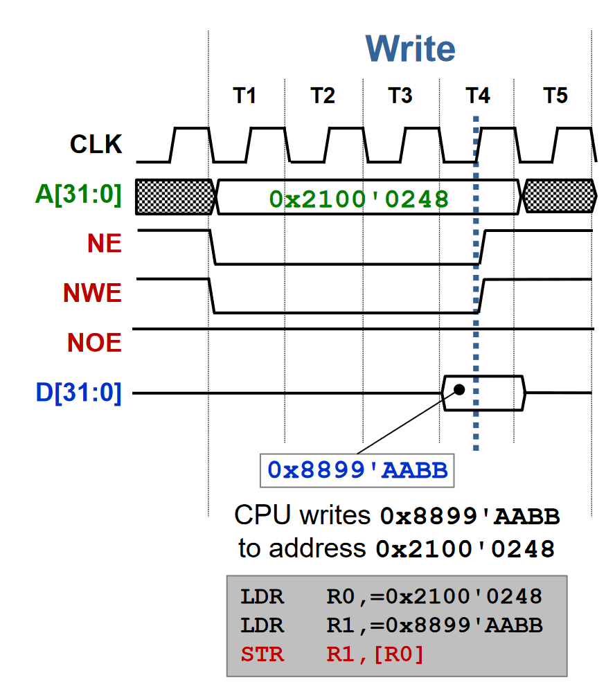
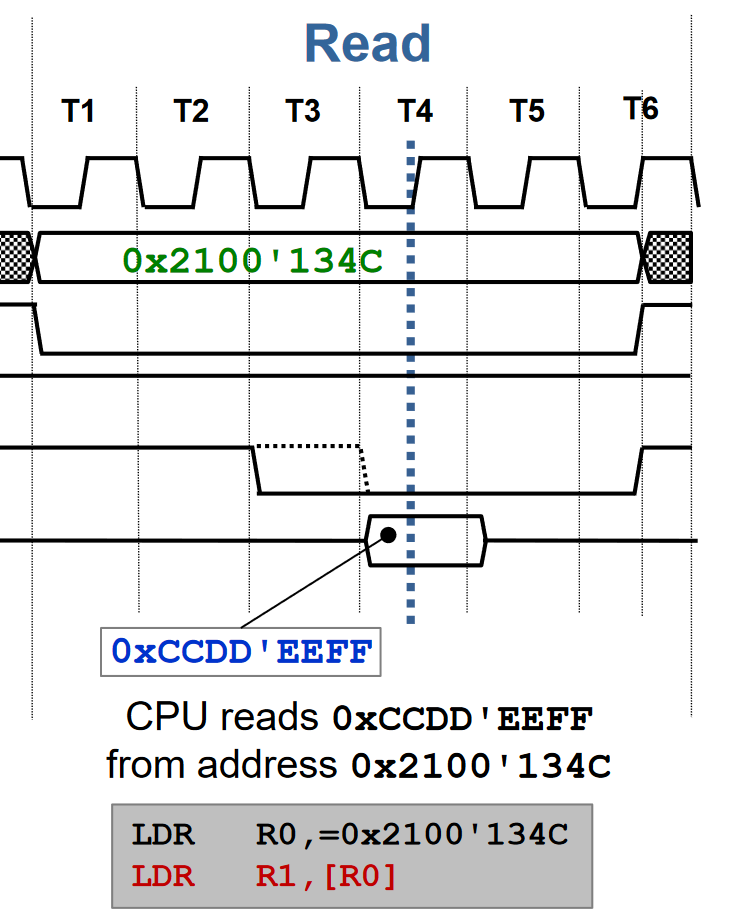
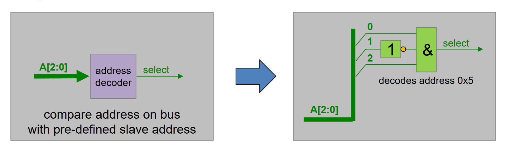
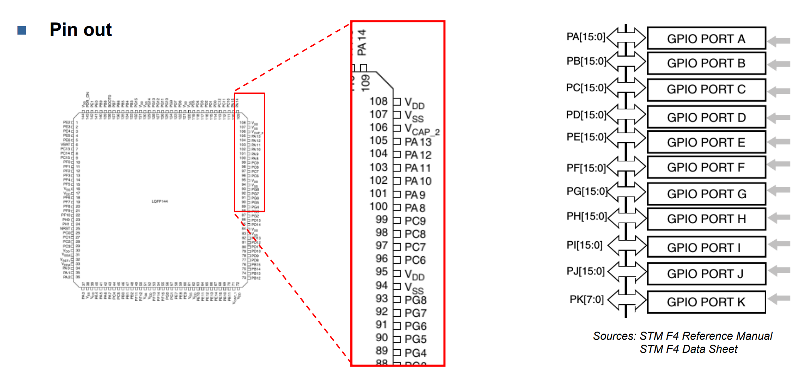
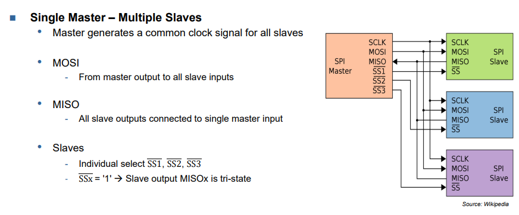
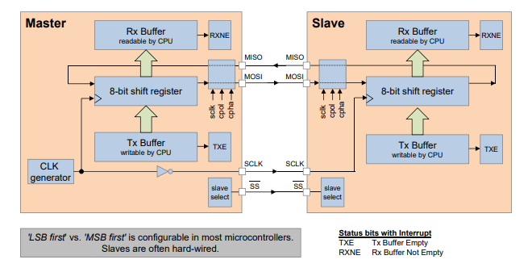
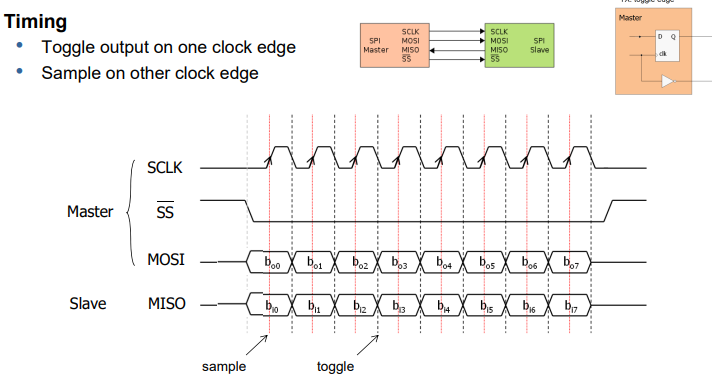
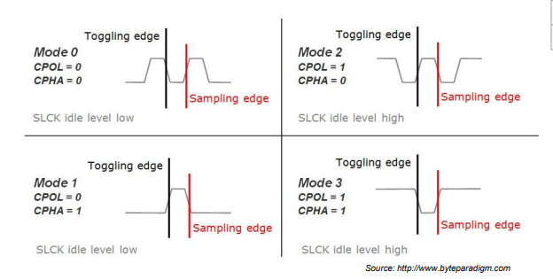
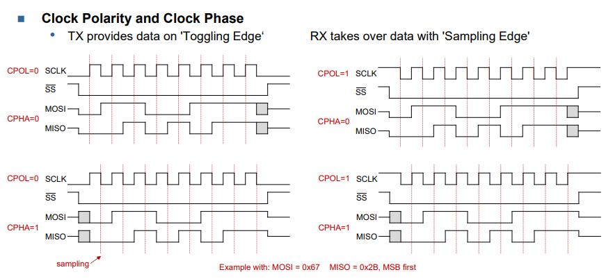
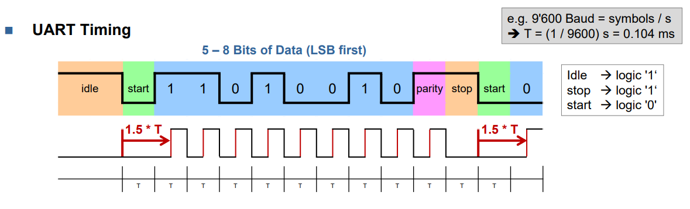

# CT2
# SW 1
CMOS tri state inverter nochmal nachlesen
ist wichtig das nicht alle gleichzeitig auf die datenleitung schreiben. 

```
NOE = 0 -> output enabled
NOE = 1 -> output disabled 
NE = Not Enable indicates start and end of cycle, acitve-low
NWE = Not write Enable, active-low
```
## Synchronous Write cycle


## Synchronous Read cycle


## Adress decoding 


Memory is LSB an der tiefsten adress least significant


## Lesen eines Wertes aus einem 8bit controll register
```
#define MY_BYTE_REG (*((volatile uint8_t *)(0x6100'0007)));

uint8_t value; 

value = MY_BYTE_REG;
```


Synchron buss timing diagramm sicher Prüfungsaufgabe
Slow slaves setie 34 auch beliebte Prüfungsaufgabe

# SW 3

Auf einem Mikrocontroller haben wir vielle funktionen aber nur eine begrenzte Anzahl Pins deshalb werden mehrere Funktionen auf den selben pin gelegt sogenannte GPIO. Deren verhalten dann von der Konfiguration abhängig ist. 
* GPIO
* ADC
* Timers
* Serial Interfaces

## Finding pins
Rechter Teil ist ein ausschnitt aus einem grösseren Diagramm. 



## Calculate Register adress
```
Base Adress + offset = Register adress
example GPIOx_TYPER register adress for GPIOA =>
GPIO adress 0x4002 0000 + offset for GIOPx_TYPER 0x04
= 0x4002 0004
```
## MODER
MODER bestimt die Funktion des Pins
* 00 Input
* 01 Generl purpose output
* 10 Alternate function mode
* 11 analoge mode 

## OTYPER 
Definiert den Output typ fall der pin als output definiert wurde. 
* 0 Output push-pull output can be high or low
* 1 Output open-drain output can only be non or low

## PUPDR
* 00 No pull-up, no pull-down
* 01 Pull-up
* 10 Pull-down
* 11 Reserved
  
## OSPEEDR
* 00 Low speed
* 01 medium speed
* 10 fast speed
* 11 high speed

## IDR
input data registry is where input data can be read from, for example from the dip switches they belong to a 'GPIOx' port to which a few pins belong

## ODR 
Output data registry, is where output data can be written to, for exmaple to the leds.

# SW4

## SPI
Serial Connections rprovide simple, low level physical connection. But requires a "higher level" protocoll usually implemente3d in software, 




## SPI modes



### C implementation

**SPI is LSB**
```
uint8_t hal_spi_read_write(uint8_t send_byte)
{
		uint8_t input; 
		set_ss_pin_low(); 
	    SPI1->DR = send_byte; 
	
		while(!(SPI1->SR & 0x2)){
		// WAIT FOR RX NOT EMPTY.  FOR ADDITIONAL BYTES,  
        HERE NOTHING
		}
		while((SPI1->SR & (0x1))==0){
			// WAIT FOR TX EMPTY 
		}

		input = SPI1->DR; 
		
		while ((SPI1->SR & (0x1 << 7)) > 0) {
			// Wait until SPI1 not busy anymore
		}
		
		wait_10_us();
		set_ss_pin_high();

		return input; 
}
```

## Taktabweichung 
bei 7 daten bits 
```
Fallende Flanke Start-Bit bis Mitte D6 = 7.5 Bits 
Maximale Abweichung für die richtige Erkennung D6: 0.5 bits 
Taktabweichung: 100% * 0.5 / 7.5 = ~ 6.67% 
```


## SW 5

## UART
In case of `UART` symbol rate = bit rate i.e. baud corresponds to bit/s.
* Synchronization 
  * Each data item (5-8 bits) requires synchronization
* Asynchronos data transfer
  * Mismatch of clcok frequencies in TX and RX
  * Requires overhad for synchronization -> additional bits
  * Requires effort for synchronization -> additional hardwaer 
* Advantage
  * Clock does not have to be transmitted
  * Transmission delays are automatically compensated
* On-board connections
  * Signal levels are 3V or 5V with reference to ground
  * Off-board connections require storonger output drivers (circuits)
* 


### U(S)ART
**Registers**\


## I2C
* Bidirectional 2-wire connection 
  * Clock -> SCL
  * Data -> SDA
* Each device on bus addressable throug unique adress
  * NXP assigns manaufacturer IDs
* 8-bit oriented data transfers
* Different bit rates up to 5 Mbit/s

### Operation 		
* Master drives clock line (SCL)
* Master initiates transaction trough `START` condition
  * Falling edge on SDA when SCL high
* master terminates transaction trough `STOP` conidtion
  * Rising edge on SDA when SCL high


**Adresing Slaves**
* Start (sda low after scl high)
* Adresse = MSB (zu erst)
* Slave -> 0 = ok(ack) |1 = not ok (nack)
* Data -> wird geschickt 1 byte gross
* Slave -> ack
* Data or stop (sda high after scl high)


## UART vs SPI vs I2C


* **Asynchronous Serial Interface** 
  * Transmitter and reciever use diverging clocks
  * Synchronization using start/stop bits
  * Longer connections require line drivers
* **SPI** 
  * Master/Slave 
  * Synchronous full-duplex transmission (MOSI, MISO)
  * Selection of device throug Slave Select \overline{SS}
  * No acknowledge, no error detection
  * Four modes -> clock polarity and clock phase
* **I2C**
  * Synchronous half-duplex transmission (SCL, SDA)
  * 7-bit slave adress (can be used with 10)

# Timer / Counter


* prescaler goes up to [1,2,4,8,32,64..]
* ARR = 65'536


```
1MHz = 1'000'000Hz
50ms timer -> 20Hz -> 1MHz/20'000 = 50 ms
1s timer -> 1Hz -> 1MHz / 
```
Strategie zur Berechnung von timern:
1) Source nehmen und Zeit berechnen (dies ergibt die kleinste einheit die das ARR produzieren kann) 
	$$ 100MHz = \frac{1}{100MHZ} = 0.01us$$
2) Prescaler berechnen die kleinste einheit des ARR über die benötigte TimerZeit bringen 
    $$Prescaler =1 \rightarrow 65'536 \approxeq 65536*0.01us = 655.36us$$
	$$Prescaler = 1000 \rightarrow  65'536 \approxeq 65536 = 655.36ms $$
	$$\text{wenn wir clock 50ms wollen heist das:} \frac{50ms*1000}{655.36us}=76.29$$
3) Wählen eines Prescalers der grösser ist als `76.29` damit wir nacher mit dem ARR noch feinjustieren können also `128`.
	$$Prescaler= 128 \rightarrow \frac{1'000'000}{128} = \underline{\underline{7812.5 ARR}}  \text{ (aufrunden)}$$ 

ges 200ms timer mit 84MHz erreichen
1) Berechnen wie oft pro sekunde ausgelöst werden muss
	$$\frac{1sec}{0.2s} = \color{red}{5}$$

2) Source nehmen und kleinster Prescaler berechnen damit mit dem maximalen ARR dies erreicht werden kann ergo 5 * pro sekunde muss man auf 65536 zählen können.
	$$\frac{\frac{84'000'000}{65536}}{\color{red}{5}} = \color{green}{256.4}$$

3) ARR für aufgerundeten minimalwert berechnen
   $$\text{Prescaler gerundet }= 257 \rightarrow \frac{84'000'000}{257} = \underline{\underline{7812.5 ARR}}  \text{ (aufrunden)}$$ 
## Timer Register 

### Base adresses 


### Timer configuration 


* Prescaler gives the CK_CNT signal 
* Divides counter clock frequency by a factor between 1 and `65'536`
* Clock fequency `CK_CNT` equal to:
$$ \boxed{\frac{\text{f}_{\text{CK\_PSC}}}{\text{PSC[15:0]}+1}}$$
* TIMx_PSC can be changed on the fly


* `CMS` Center aligned mode
  * 00 count up or down depending on DIR
  * others = center aligned
* `DIR` Direction
  * 0 up-counter
  * 1 down-counter
* `CEN` Counter enable
 


* This register is used to select the various clcok and trigger sources
* SMS: Master/slave mode
  * 000: Slave mode off -> using itnernal clock (CK_INT)
* don't fuck with it leave it at 000

## Input Capture CCR
Counts ticks between timer start and an event. 

# PWM 


* this is used to dimm LEDs for exmaple as it produces on average a lower voltage per cycle as an on off would do. 


* Toggle output pin when counter reaches CCR
* can be used to compare cou nter with CCR and rais an interrupt used for constantly checking a value like temperature in an oven. 

## UP-/Down-counting


## PWM Configuration


* **PWM output cookbook**
  * Select counter clock (internal, external, prescaler)
  * Write desired data to TIMx_ARR register
    * -> defines common period of PWM signals
  * Write desired data to TIMx_CCRx regsiters
    * -> defines duty cycles of PWM signals
  * Set **CCxIE** bits if **interrupts** are to be generated (in TIMx_DIER register)
  * Select the output mode (registers CCMRx /CCER)
  * Enable counter by setting the CEN bit in TIMx_CR1 register. 


# ADC / DAC 
$$V_{\text{REF+}}= \text{Refrenze Spannung}$$
$$V_{\text{in}}= \text{Spannung die zu Konvertieren ist}$$
$$\boxed{V_{\text{in}}=\frac{(\text{digital value})* V_{\text{REF+}}}{(2^N)}}$$
$$\text{LSB} = \text{Least Significant Bit}$$
$$\boxed{\text{LSB} = \frac{V_{\text{REF+}}}{2^N}}$$
$$V_{\text{FSR}}= \text{Full Scale Range / Abbildbare Spannungsweite}$$
$$V_{\text{FSR}} = V_{\text{REF+}} - 1*LSB$$

Angenommen wir haben eine Eingangspannung V_REF von 3V und eine Auflösung N von 3 bits bekommen wir folgende grössen:
```
LSB = 3V/2^3 = 0.375V
V_FSR = 3V - 0.375V = 2.625V 
V_in = (7(111) * 3V)/ 2^3 = 2.625V
```


## DACs
$$\boxed{V_{\text{out}}=\frac{(\text{digital value})* V_{\text{REF+}}}{(2^N)}}$$


### Quantization error
DAC introduces an error between -0.5 LSB and +0.5 LSB

### Offset error


